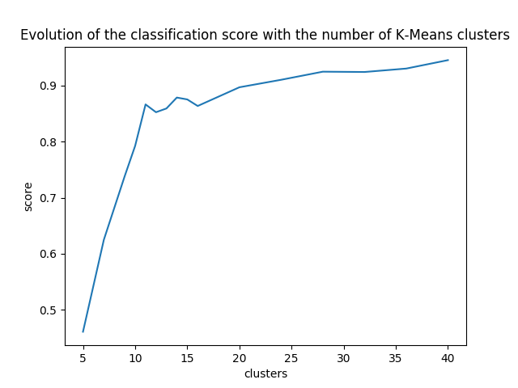
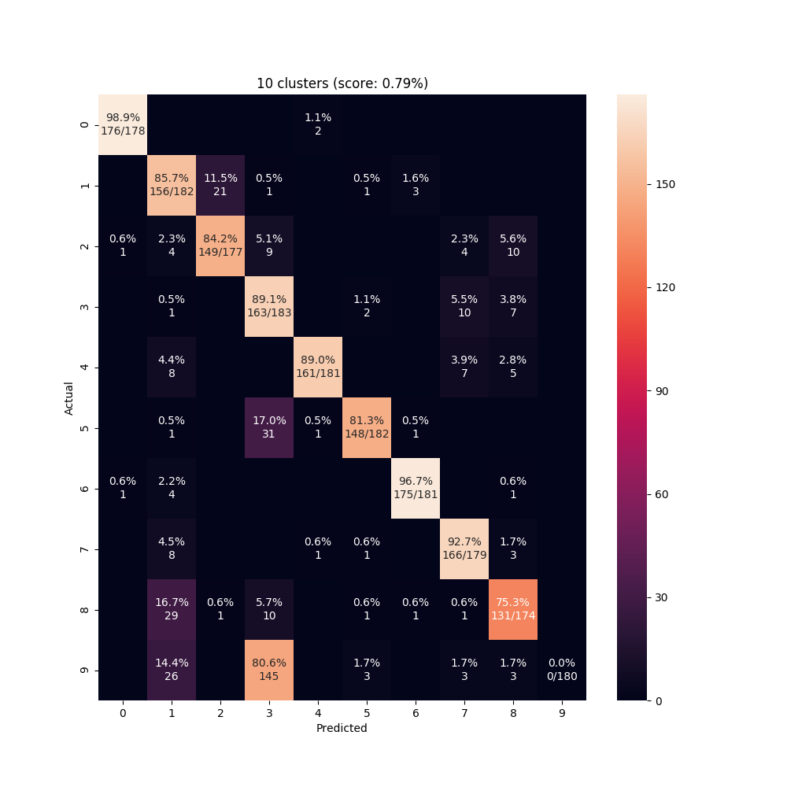
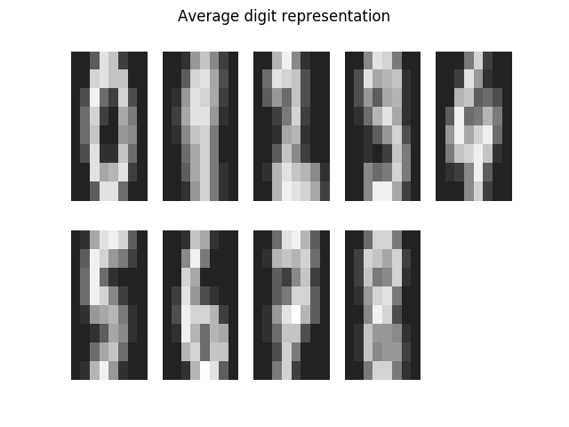
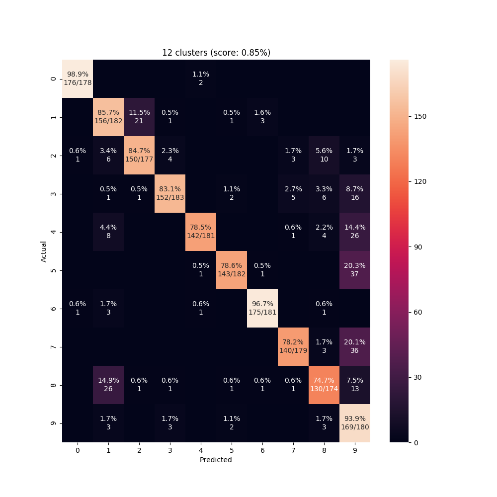
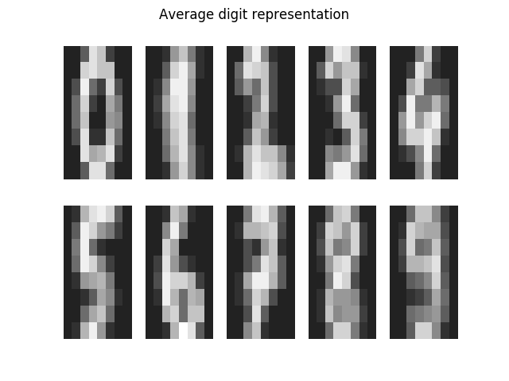

# K-Means

## Usage
```sh
# first time: create the fig/ folder
mkdir fig
python3 kmean.py
```
It starts a kmean classification for various cluster sizes, then a detailed analysis on the best parameter found experimentally.
Figures are found in the `fig` folder.

## Results

### Evolution of the classification wrt the number of clusters




### Detailed analysis of K-Mean classification with 10 clusters

#### Confusion matrix


#### Representative element of each cluster


We observe that with only 10 clusters, no class is affected to the digit '9'. The nines and threes got mixed.


### Detailed analysis of K-Mean classification with 12 clusters

#### Confusion matrix


#### Representative element of each cluster


